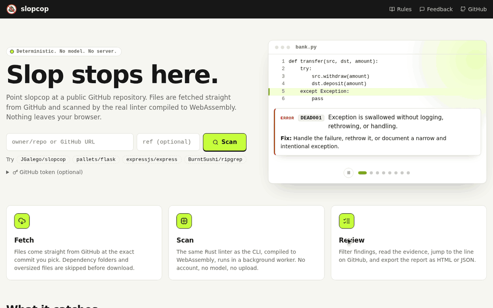

<div align="center">
  
  <h1>slopcop</h1>
  <p><strong>Slop stops here.</strong></p>
  <p>
    <a href="https://github.com/JGalego/slopcop/actions/workflows/ci.yml"></a>
    <a href="https://crates.io/crates/slopcop"></a>
    <a href="LICENSE"></a>
    
    
  </p>
</div>

We don't care whether AI wrote it. We care whether it's slop.

`slopcop` finds observable quality problems in source code, comments, documentation, and repository configuration. It is deterministic, runs without a network or model, and reports the evidence behind each finding. A human can write slop. AI can write excellent code. Authorship is not the question.

```text
$ slopcop .

README.md:42:1  VIBE001  warning
Formulaic transitions are unusually dense.

src/api.py:118:1  DEAD001  error
Exception is swallowed without logging, rethrowing, or handling.

2 finding(s). Nice try, robot.
```

To try it without installing anything, open the [browser demo](https://slopcop.me) and enter a public GitHub repository. The scanner runs locally as WebAssembly.



## Getting started

Install a prebuilt binary on macOS or Linux (into `~/.local/bin`):

```sh
curl -fsSL https://raw.githubusercontent.com/JGalego/slopcop/main/install/install.sh | sh
```

On Windows (into `%LOCALAPPDATA%\Programs\slopcop`, added to your user `PATH`):

```powershell
irm https://raw.githubusercontent.com/JGalego/slopcop/main/install/install.ps1 | iex
```

Both scripts download the latest release from GitHub and verify its SHA-256 checksum before installing. They need no root or administrator rights. Set `SLOPCOP_VERSION=v0.3.1` to pin a release, `SLOPCOP_PREFIX` to choose the install directory, or `SLOPCOP_SOURCE=1` to build from source with cargo. Re-running a script replaces the installed binary.

Or install from crates.io:

```sh
cargo install slopcop
```

Or install the current source revision:

```sh
cargo install --git https://github.com/JGalego/slopcop
```

Run a repository scan:

```sh
slopcop .
```

Initialize a conservative config and pre-commit entry:

```sh
slopcop init
```

Useful commands:

```sh
slopcop src/ README.md
slopcop --staged
slopcop --diff
slopcop --changed --base origin/main
slopcop --stdin --stdin-filename src/app.py < src/app.py
slopcop commit-message .git/COMMIT_EDITMSG
slopcop history --base origin/main
slopcop explain VIBE001
slopcop lsp
slopcop rules
slopcop benchmark
```

Exit code `0` means clean or below the configured failure threshold. Findings at or above that threshold return `1`; usage and configuration errors return `2`; internal failures return `3`.

## What it checks

**deadweight** finds code and prose that appear to exist without doing useful work: swallowed exceptions, escaped placeholders, empty concrete functions, trivial assertions, redundant comments, pointless Boolean branches, duplicated blocks, and empty documentation sections.

**papertrail** checks commit messages and branch history for placeholder subjects and autosquash commits that should not reach an integration branch.

**vibecheck** measures patterns in prose and code comments: clustered stock transitions, assistant framing, generic modifier density, repeated sentence openings, forced symmetry, restatement, disclaimer clusters, and unusually uniform rhythm. One use of “robust” or “ultimately” is not a finding. Density and repetition are.

The rule index documents every stable rule. `slopcop explain RULE_ID` prints rationale, examples, false-positive notes, and configuration guidance.

## Configuration

Projects use `.slopcop.toml`:

```toml
[slopcop]
fail-level = "warning"
max-file-size = 1000000

[slopcop.deadweight]
enabled = true

[slopcop.papertrail]
enabled = true

[slopcop.vibecheck]
enabled = true

[slopcop.rules]
VIBE003 = "info"
DEAD004 = "error"

[slopcop.ignore]
paths = ["vendor/**", "generated/**"]
```

Rule values are `info`, `warning`, `error`, or `off`. Configuration discovery walks from the current directory toward the filesystem root. Unknown rule IDs and configurations that disable every rule are rejected. The complete schema is documented in [configuration](docs/configuration.md).

## Suppressions

Suppress a named rule on the same or following line and include a reason:

```python
# slopcop: ignore DEAD004 -- optional compatibility probe
return None
```

Wildcard suppressions and reason-free directives do nothing. Broad exclusions belong in project configuration where reviewers can see them.

## Git and pre-commit

`--staged` reads blobs from the Git index, not the working tree. `--diff` scans working-tree additions and modified hunk lines. `--changed --base REV` compares committed `HEAD` content with its merge base, independently of local edits. Git path arguments are relative to the current directory.

```yaml
repos:
  - repo: https://github.com/JGalego/slopcop
    rev: v0.3.1
    hooks:
      - id: slopcop
      - id: slopcop-commit-msg
```

  The normal hook scans filenames supplied by pre-commit, which hides unstaged edits during commit checks. The `commit-msg` hook checks the proposed subject but deliberately allows `fixup!` and `squash!` while a series is being prepared. `slopcop history --base REV` checks committed branch history and reports those autosquash markers. Install both stages with `pre-commit install --hook-type pre-commit --hook-type commit-msg`. `pre-commit run --all-files` checks all tracked files. This repository uses local entries; `make bootstrap` builds the binary and installs both hook types with `pre-commit` or `uvx`.

## CI and machine output

On GitHub, use the bundled action. On pull requests it reports findings on changed lines as annotations; on other events it scans everything:

```yaml
- uses: actions/checkout@v5
- uses: JGalego/slopcop@main
```

Inputs select paths, the release, changed-line mode, and SARIF upload to code scanning. They are documented with the other [integrations](docs/integrations.md), which also cover GitLab CI, reviewdog, and Azure Pipelines.

In editors, `slopcop lsp` runs a language server with diagnostics, rule explanations on hover, and a quick fix that inserts a suppression directive. Releases include a VS Code extension, and setup for Neovim, Helix, Emacs, and JetBrains IDEs is in [integrations](docs/integrations.md).

JSON, SARIF 2.1.0, GitHub workflow annotations, GitLab Code Quality, and HTML reports are built in:

```sh
slopcop . --format json
slopcop . --format sarif > slopcop.sarif
slopcop . --format github
slopcop . --format gitlab > gl-code-quality-report.json
slopcop . --format html > slopcop.html
```

The HTML report is a single self-contained page with no scripts or external resources, so it can be attached to a CI run or opened offline. It lists the findings by file, with a severity filter, and explains every rule that fired.

The included CI workflow runs formatting, Clippy, tests, package verification, release-mode self-lint, and the benchmark smoke check. Self-hosting tests require every module and rule to remain enabled and verify that all source and documentation artifacts are discovered and scanned without size or generated-file skips.

## Performance

Normal scans make no network requests, download no models, and send no telemetry. Discovery respects `.gitignore` and the `linguist-vendored` and `linguist-generated` attributes in `.gitattributes`, skips common dependency, third-party, and build directories, rejects binary, oversized, generated, and minified bundle files early, and scans files in parallel. Rules reuse cached prose, sentence, and paragraph analysis.

Repeated release runs on the development x86_64 Linux host scanned the 4,096-file mixed benchmark in **63.7–78.8 ms** at **51,961–64,286 files/sec**. Treat machine-specific numbers as samples, not promises. Reproduce all five profiles with `slopcop benchmark`; methodology and results live in [benchmarks](benchmarks/README.md).

## Field testing

A slop detector is only useful if it aims well, so we took slopcop out of its own repository and pointed it at real projects.

We started with the obvious suspects, popular projects built with coding agents such as [OpenClaw](https://github.com/openclaw/openclaw), [Open Design](https://github.com/nexu-io/open-design), [Onlook](https://github.com/onlook-dev/onlook), [Understand Anything](https://github.com/Egonex-AI/Understand-Anything), and [CodexBar](https://github.com/steipete/CodexBar). These scans showed what slopcop catches in the wild. They also showed where it fired on code that was fine, like a rethrow that keeps an error away from a broader handler, or a Markdown table read as repetitive prose.

| Project | Commit | Date |
|---|---|---|
| [ccpm](https://github.com/automazeio/ccpm) | [`7d7e462`](https://github.com/automazeio/ccpm/commit/7d7e4623bc6d4c0c9ba66ca6bfecd7e5261dc697) | 2026-03-18 |
| [CodexBar](https://github.com/steipete/CodexBar) | [`412de07`](https://github.com/steipete/CodexBar/commit/412de0700930997fb868a4cb4e3800c4743e13c2) | 2026-10-06 |
| [free-claude-code](https://github.com/Alishahryar1/free-claude-code) | [`9194f15`](https://github.com/Alishahryar1/free-claude-code/commit/9194f157af6beb663cf3e6035f9cdadb09e8917b) | 2026-10-04 |
| [frontend-slides](https://github.com/zarazhangrui/frontend-slides) | [`9906a34`](https://github.com/zarazhangrui/frontend-slides/commit/9906a34d640d2111f724544cbc50f7f130569ae1) | 2026-06-23 |
| [Onlook](https://github.com/onlook-dev/onlook) | [`423e2e9`](https://github.com/onlook-dev/onlook/commit/423e2e924366419e418ee049093872d535eea41a) | 2026-07-21 |
| [Open CoDesign](https://github.com/OpenCoworkAI/open-codesign) | [`6799d55`](https://github.com/OpenCoworkAI/open-codesign/commit/6799d55339d5425ca03a10d4ce20ed7c19e53d0d) | 2026-10-04 |
| [Open Design](https://github.com/nexu-io/open-design) | [`53231d4`](https://github.com/nexu-io/open-design/commit/53231d40b778d88eba23f35547bf99485d3ae9fc) | 2026-09-30 |
| [OpenClaw](https://github.com/openclaw/openclaw) | [`8177060`](https://github.com/openclaw/openclaw/commit/8177060846209e40a506e442785a7736f31db674) | 2026-10-07 |
| [taste-skill](https://github.com/Leonxlnx/taste-skill) | [`ce26fc2`](https://github.com/Leonxlnx/taste-skill/commit/ce26fc25c0e5e8cab638f883de62d9a86ee5e45b) | 2026-09-26 |
| [Understand Anything](https://github.com/Egonex-AI/Understand-Anything) | [`790b157`](https://github.com/Egonex-AI/Understand-Anything/commit/790b157028637b626c8666fa7fa28248944b900c) | 2026-10-06 |

Humans write slop too, so the harder test was code from projects that ban or restrict AI contributions, such as [Godot](https://github.com/godotengine/godot), [curl](https://github.com/curl/curl), and [Zig](https://codeberg.org/ziglang/zig). People wrote that code, so each finding there was either human slop or a mistake in slopcop. Plenty were real, such as TODOs with no owner, copy-pasted blocks, and handlers that discard errors without a word. The rest were false alarms, such as vendored code or methods that are empty on purpose.

| Project | Commit | Date |
|---|---|---|
| [Cloud Hypervisor](https://github.com/cloud-hypervisor/cloud-hypervisor) | [`a2d0af3`](https://github.com/cloud-hypervisor/cloud-hypervisor/commit/a2d0af33923baa9547bccb649a56fdd350d725df) | 2026-10-07 |
| [curl](https://github.com/curl/curl) | [`11d0b20`](https://github.com/curl/curl/commit/11d0b202136debd81c9cc8dae49f3396670d0b85) | 2026-10-07 |
| [Forgejo](https://codeberg.org/forgejo/forgejo) | [`35d2a62`](https://codeberg.org/forgejo/forgejo/commit/35d2a6245eef8206879a3aa8d54447a780fcb6ef) | 2026-10-07 |
| [Gentoo](https://codeberg.org/gentoo/gentoo) | [`789d172`](https://codeberg.org/gentoo/gentoo/commit/789d172caede0c1f996ccbff00e315ed49255589) | 2026-10-07 |
| [Ghostty](https://github.com/ghostty-org/ghostty) | [`b699ea7`](https://github.com/ghostty-org/ghostty/commit/b699ea79f4b881421b4b3055abc16a0957d76beb) | 2026-10-06 |
| [GIMP](https://github.com/GNOME/gimp) | [`1b80b35`](https://github.com/GNOME/gimp/commit/1b80b358d72924569e649e84563a6914f46dd6b5) | 2026-10-06 |
| [Godot](https://github.com/godotengine/godot) | [`3ea0cf3`](https://github.com/godotengine/godot/commit/3ea0cf3e72699c5e3b35f7956670ac93b9d1d4a0) | 2026-10-06 |
| [Jellyfin](https://github.com/jellyfin/jellyfin) | [`32efb47`](https://github.com/jellyfin/jellyfin/commit/32efb47601d3ce4174f61a66181d9e4665288c92) | 2026-10-05 |
| [Portage](https://github.com/gentoo/portage) | [`54c7ac9`](https://github.com/gentoo/portage/commit/54c7ac99ed54dbae13520ea00083e214c7fc11c8) | 2026-10-03 |
| [QEMU](https://github.com/qemu/qemu) | [`f9587d4`](https://github.com/qemu/qemu/commit/f9587d4045c67cd0d8d8bdcd5d0bb5b6b395b63c) | 2026-10-06 |
| [Servo](https://github.com/servo/servo) | [`64c4855`](https://github.com/servo/servo/commit/64c4855e7dd2972b216ec622e804f0e1fdf42f7e) | 2026-10-07 |
| [Zig](https://codeberg.org/ziglang/zig) | [`26fd35f`](https://codeberg.org/ziglang/zig/commit/26fd35ff902cb0f68ada18706e7f670b4aac3d4a) | 2026-10-07 |

We reviewed the findings by hand. Each false positive or bug became its own fix with a regression test, so it stays fixed, and the real slop stayed flagged.

## Philosophy

`slopcop` does not estimate an “AI probability.” It reports concrete artifacts and calibrated rule confidence. The defaults favor high signal over high recall; suspicious style is normally a warning, while clearly useless constructs can be errors.

It complements compilers, formatters, and conventional linters. Syntax errors belong to those tools. `slopcop` asks why a wrapper, comment, fallback, test, or paragraph exists at all.

## Contributing

Run the full local gate with:

```sh
make check
```

Each rule needs stable metadata, implementation tests, a positive fixture, a clean control, documentation, and a false-positive note. Start with [CONTRIBUTING.md](CONTRIBUTING.md) and the [rule development guide](docs/contributing-rules.md).

## License

MIT. See [LICENSE](LICENSE).